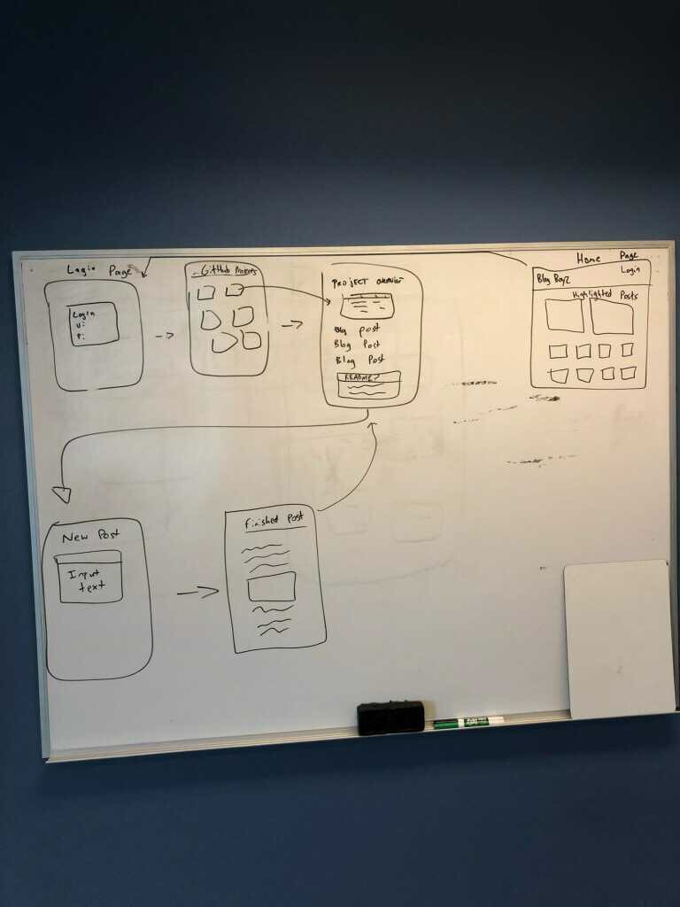
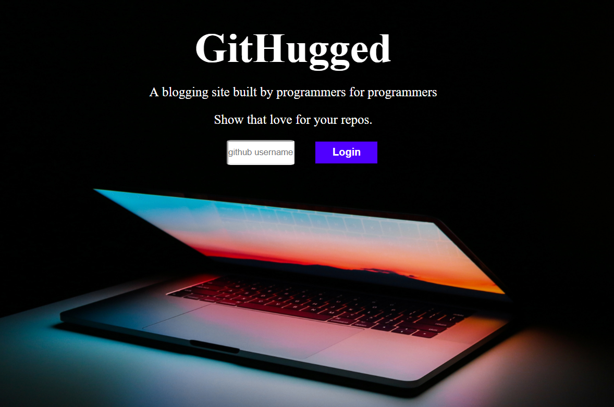

# GitHugged

#### By **Ian Cook Westgate**, **Dino Nguyen**, **Jack Collins**, **Matt Groberg**

## Description

Have you ever complained about the inability of Medium, Blogger, and Wordpress to reference your GitHub account? Have you ever wanted to blog about the projects you create on GitHub to an audience of enthusiastic fellow programmers? GitHugged is the site for you: a blogging hub where you can get recognition and show support for your GitHub labors as you work on every new project, all with easy reference to every bit of data you need from your GitHub account.

Firebase URL: blog-40113.firebaseapp.com

## Wireframing



## Landing Page



## Features

* User can incorporate their repository info by logging into Github.
* Full blogging functionality through the TinyMCE text editor.
* All created posts can be assigned to the GitHub repo of the user's choice. These posts are then accessible and readable by anyone on GitHugged.

## Setup/Installation

* Clone this repository: https://github.com/jackpaulcollins/angular-team-project.git.
* Using a terminal of your choice (I use Windows Powershell), navigate to the folder in the terminal from the desktop by typing in: "cd angular-team-project".
* Still in the terminal, input `npm i` to install dependencies.
* Then input `ng serve --open` to automatically view the project in your default browser. This will run it locally, without access to a database and only showing the basics of the site. To access the database, follow the instructions just below to achieve live deployment.

## Live Deployment Instructions

* You will need to create an API file by, within the terminal, inputting `touch src/app/api-keys.ts`.
* Create and/or sign-in to your account with https://firebase.google.com/
* Click the "GO TO CONSOLE" link in the top right of the screen.
* On the next page, click "Add project" below the + sign. Your project name should align with the overall project. Name it angular-team-project.
* Locate and open the `api-keys.ts` file that we created in the project.
* Inside this file, add this line
```bash
export const masterFirebaseConfig = {
  apiKey: "xxxx",
  authDomain: "xxxx.firebaseapp.com",
  databaseURL: "https://xxxx.firebaseio.com",
  storageBucket: "xxxx.appspot.com",
  messagingSenderId: "xxxx"
};
```
* Navigate to https://www.firebase.com and click on Go To Console in the top right corner. Select the project we created. In Project Overview, you should see a symbol that looks like this </>. Click it to showcase the info you need.
* In your `api-keys.ts` file, replace all the x's with the information that Firebase just gave you.
* Back in Firebase, make sure you view the rules under Database and that they are set to true in order to run and edit the live version hosted Firebase.
* You will also need to add the API key for TinyMCE which you can get at https://www.tiny.cloud/. Add the following to your `api-keys.ts`:
```bash
apiKey = "YOUR-API-KEY-GOES-HERE";
export const tinyApiKey = "YOUR-API-KEY-GOES-HERE";
```
* Go in your terminal and input `ng build --env=prod`.
* Now input `firebase deploy`.
* Now input `firebase open` Scroll down and select `Hosting: Deployed Site`. Now you should be able to see and interact with the website and upload posts to the database you've created!

## Planned Features

* Allow user to login into a database unique to Githugged that keeps track of user's posts and allows additional interactivity with the site.
* Permit anonymous site visitors to read posts without having to provide Github login information.
* Input additional Github info for the user, such as easily viewable READMEs and a display for project files.

## Technologies Used

* HTML
* CSS
* JavaScript
* Babel
* NPM
* Webpack
* Firebase
* Angular CLI version 1.6.5
* API
  * GitHub
  * TinyMCE

## Known Bugs

* On the landing page, the user has to click submit twice in order for the site to move on to the next page.
* Though the site appears to function normally, once you have passed the landing page, inspecting the console reveals a number of errors that have yet to be solved.
* Navigation bar is not fully functional. Clicking on logout button results in console errors.

## License

This software is licensed under the MIT license.

Copyright (c) 2019 **Jack Collins**, **Ian Cook Westgate**, **Matt Groberg**, **Dino Nguyen**
